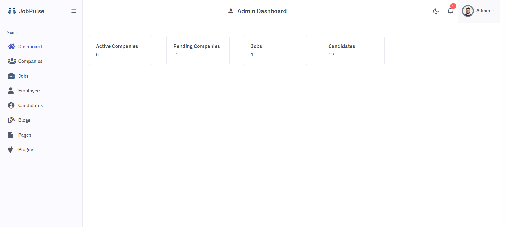

<!-- PROJECT LOGO -->
<br />
<div align="center">
  <a href="">
    
  </a>

[//]: # (<h2 align="center"> JobPulse: Job Portal Management System</h2>)

## JobPulse: Job Portal Management System

  <p align="center">JobPulse is a versatile job portal management system designed to streamline the recruitment process for companies and candidates alike. With distinct user roles for main system owners, job-providing companies, and candidates, JobPulse offers a tailored experience for each user type </p>


<hr>
<a href="https://jobpulse.dev-sabbir.com">Live Website</a>

<a href="https://drive.google.com/file/d/1uxqyD_eLux6rHKvKKzilDdhgCybBNY8O/view?usp=drive_link">Demo Video</a>
<hr>
</div>


<!-- TABLE OF CONTENTS -->
<details>
  <summary>Table of Contents</summary>
  <ol>
    <li>
      <a href="#about-the-project">About The Project</a>
    </li>
    <li>
      <a href="#getting-started">Getting Started</a>
    </li>
    <li><a href="#product-requirement-and-roadmap">Product Requirement and Roadmap
</a></li>
    <li><a href="#database-design">Database Design</a></li>
    <li><a href="#contact">Contact</a></li>
    <li><a href="#acknowledgments">Acknowledgments</a></li>
  </ol>
</details>


<!-- ABOUT THE PROJECT -->

## About The Project


<hr>

<p>Main system owners have full control over the system, managing 
companies, job listings, blogs, and other system components. 
Job-providing companies can register, login, and effortlessly 
manage their job postings and blogs. Candidates can easily register, 
login, and apply to job listings posted by companies.</p>


<p align="right">(<a href="#jobPulse-job-portal-management-system">back to top</a>)</p>

## Built With
### Frontend

- [![JQuery][JQuery.com]][JQuery-url]
- [![Bootstrap][Bootstrap.com]][Bootstrap-url]

### Backend
- [![Laravel][Laravel.com]][Laravel-url]
- ![MySql][mysql.com]

### Authentication
- 

### Tools and Library
- ![Axios][axios.com]
- 
- 
- 
- 
- 
-  
<p align="right">(<a href="#jobPulse-job-portal-management-system">back to top</a>)</p>

<!-- GETTING STARTED -->

## Getting Started

### Prerequisites

* PHP 8.1+
* Laravel 10.x+
* Composer (dependency manager for PHP)
* Database (MySQL/ PostgreSQL/ SQLite/ SQL Server)
* Git

### Installation

Please Follow the steps to install this project Locally.

#### 1. Clone the repo

Open your terminal and navigate to the directory where you want to install the Laravel project.
Then run the following command:

   ```sh
   git clone https://github.com/Sabbir-Hossain12/JobPulse
   ```

#### 2. Navigate to Project Directory

Move into the project directory:

   ```sh
   cd JobPulse
   ```

#### 3. Install Dependencies

Once you are in the project directory, use Composer to install the required dependencies:

   ```sh
   composer install
   ```

#### 4. Create Environment File

Laravel requires an environment file for configuration. Duplicate the .env.example file and save it as .env:

   ```sh
   cp .env.example .env
   ```

#### 5. Generate Application Key

Run the following command to generate a unique application key:

   ```sh
php artisan key:generate
   ```

#### 6. Run Migrations

Use the following command to run database migrations:

   ```sh
  php artisan migrate
   ```   
#### 7. Run Database Seeding

To populate your database with initial or test data, use the following command:

   ```sh
 php artisan db:seed
   ```  

#### 8. Serve the Application

You can use Laravel's built-in development server to run the application locally.
Execute the following command:

```sh
php artisan serve
```   

This will start a development server, and you can access your Laravel application at http://127.0.0.1:8000 in your web
browser.
<hr>
<p align="right">(<a href="#jobPulse-job-portal-management-system">back to top</a>)</p>


<!-- ROADMAP -->

## Project Requirement and Roadmap

### User Types:
1. Main System Owner: 
- Responsible for managing the entire system.

2. Companies:
- Job-providing companies that post job listings.
3. Candidates: 
- Individuals seeking job opportunities.

### Roles & Permissions:
Main System Owner has full control over the system.
Job-providing companies can register, login, and manage their job postings.
Candidates can apply to job listings after logging in.

### Modules:
1. Main System Owner:
- Frontend: Home, About, Jobs, Contact, Login pages.
- Backend: Dashboard, Companies, Jobs, Blogs, Pages, Plugins, Account Settings.
2. Job Providing Companies:
- Frontend: Login, Registration, Forget Password.
Backend: Dashboard, Jobs, Blogs, Plugins, Account Settings.
- 
3. Candidates:
- Frontend: Login, Registration, Forget Password.
- Backend: Dashboard, Jobs, Profiles, Account Settings.
4. Optional Modules:
- Employee Module: Can be developed with roles and permissions or kept as a plugin card.
- Blogs Feature: For job-providing companies, this feature is added as a plugin. 

### Functionality:
- Main System Owner manages the overall system, including companies, jobs, blogs, and pages.
- Companies can register, login, and manage their job listings and blogs.
- Candidates can register, login, and apply to job listings.
- Blogs feature is available for both companies and the main system owner.
- Frontend and Backend:
- Separate frontend and backend components are developed for each user type.
- Frontend includes pages for user interaction, such as home, about, jobs, contact, login, registration, and account settings.
- Backend includes dashboards for managing various aspects of the system, such as jobs, profiles, blogs, plugins, and account settings.
### Plugins:
- Employee module and blogs feature are implemented as plugins.
- Plugins can be added or removed based on system requirements and preferences.

<p align="right">(<a href="#jobPulse-job-portal-management-system">back to top</a>)</p>
<hr>

[//]: # (## Database Design)

[//]: # ()
[//]: # ()


<!-- CONTACT -->

## Contact

Sabbir Hossain- h.sabbir36@yahoo.com

Project Link: https://github.com/Sabbir-Hossain12/JobPulse.git

<p align="right">(<a href="#jobPulse-job-portal-management-system">back to top</a>)</p>


<!-- ACKNOWLEDGMENTS -->

## Acknowledgments

This project uses the following third-party resources:

- HTML and CSS Template: [JobFinderPortal](https://colorlib.com/wp/template/jobfinderportal/) by [Colorlib](https://colorlib.com/)
     - While the template provided the foundation for the user interface, I implemented additional JavaScript and JQuery functionalities to enhance interactivity
        and user experience.

- [Unsplash](https://unsplash.com/) for Images.

  <hr>
<!-- MARKDOWN LINKS & IMAGES -->
<!-- https://www.markdownguide.org/basic-syntax/#reference-style-links -->

[contributors-shield]: https://img.shields.io/github/contributors/othneildrew/Best-README-Template.svg?style=for-the-badge

[contributors-url]: https://github.com/othneildrew/Best-README-Template/graphs/contributors

[forks-shield]: https://img.shields.io/github/forks/othneildrew/Best-README-Template.svg?style=for-the-badge

[forks-url]: https://github.com/othneildrew/Best-README-Template/network/members

[stars-shield]: https://img.shields.io/github/stars/othneildrew/Best-README-Template.svg?style=for-the-badge

[stars-url]: https://github.com/othneildrew/Best-README-Template/stargazers

[issues-shield]: https://img.shields.io/github/issues/othneildrew/Best-README-Template.svg?style=for-the-badge

[issues-url]: https://github.com/othneildrew/Best-README-Template/issues

[license-shield]: https://img.shields.io/github/license/othneildrew/Best-README-Template.svg?style=for-the-badge

[license-url]: https://github.com/othneildrew/Best-README-Template/blob/master/LICENSE.txt

[linkedin-shield]: https://img.shields.io/badge/-LinkedIn-black.svg?style=for-the-badge&logo=linkedin&colorB=555

[linkedin-url]: https://linkedin.com/in/othneildrew

[product-screenshot]: images/screenshot.png

[Next.js]: https://img.shields.io/badge/next.js-000000?style=for-the-badge&logo=nextdotjs&logoColor=white

[Next-url]: https://nextjs.org/

[React.js]: https://img.shields.io/badge/React-20232A?style=for-the-badge&logo=react&logoColor=61DAFB

[React-url]: https://reactjs.org/

[Vue.js]: https://img.shields.io/badge/Vue.js-35495E?style=for-the-badge&logo=vuedotjs&logoColor=4FC08D

[Vue-url]: https://vuejs.org/

[Angular.io]: https://img.shields.io/badge/Angular-DD0031?style=for-the-badge&logo=angular&logoColor=white

[Angular-url]: https://angular.io/

[Svelte.dev]: https://img.shields.io/badge/Svelte-4A4A55?style=for-the-badge&logo=svelte&logoColor=FF3E00

[Svelte-url]: https://svelte.dev/

[Laravel.com]: https://img.shields.io/badge/Laravel-FF2D20?style=for-the-badge&logo=laravel&logoColor=white

[Laravel-url]: https://laravel.com

[Bootstrap.com]: https://img.shields.io/badge/Bootstrap-563D7C?style=for-the-badge&logo=bootstrap&logoColor=white

[Bootstrap-url]: https://getbootstrap.com

[JQuery.com]: https://img.shields.io/badge/jQuery-0769AD?style=for-the-badge&logo=jquery&logoColor=white

[JQuery-url]: https://jquery.com 

[Datatable-url]: https://datatables.net/

[Datatable.com]: https://img.shields.io/badge/DataTables-0769AD?style=for-the-badge&logo=dataTables&logoColor=white

[axios.com]: https://img.shields.io/badge/axios-0769AD?style=for-the-badge&logo=axios&logoColor=white
[mysql.com]: https://img.shields.io/badge/mysql-white?style=for-the-badge&logo=mysql&logoColor=black